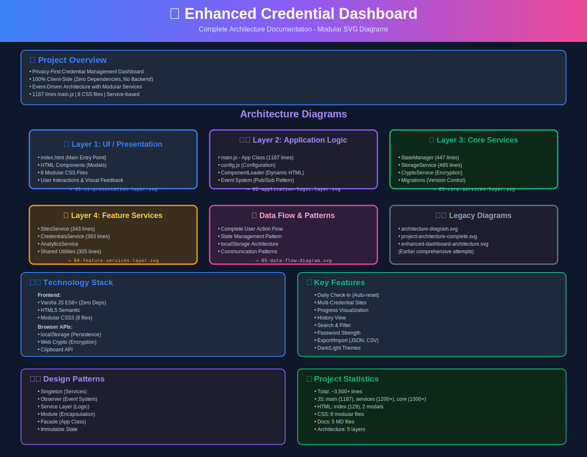
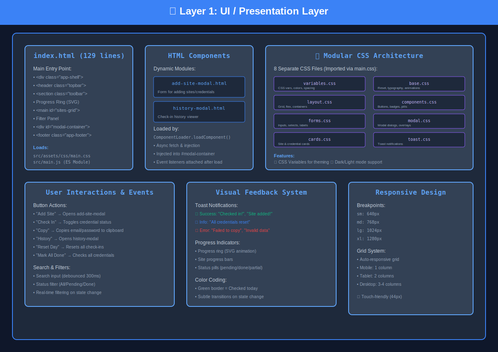
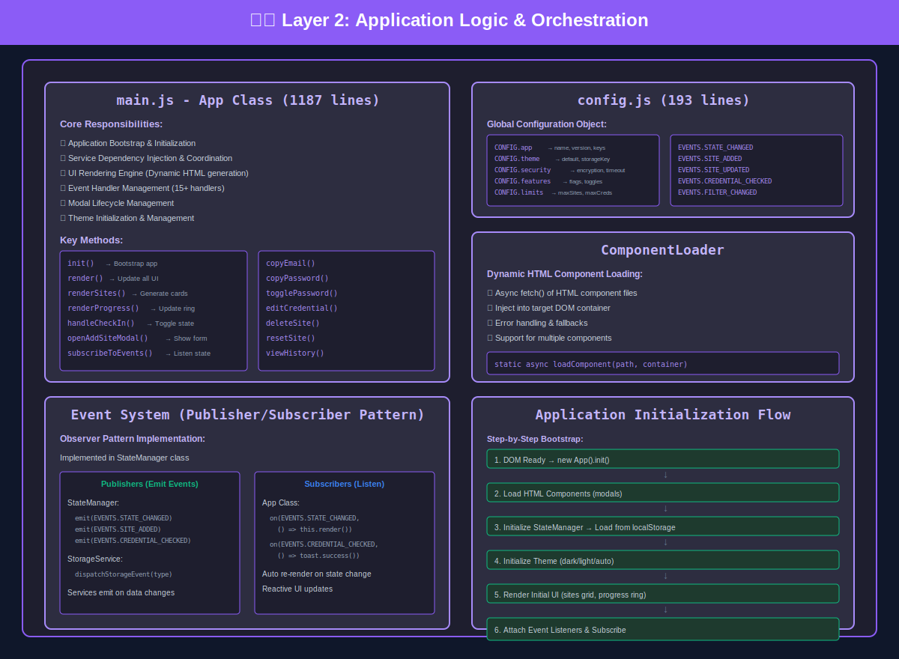
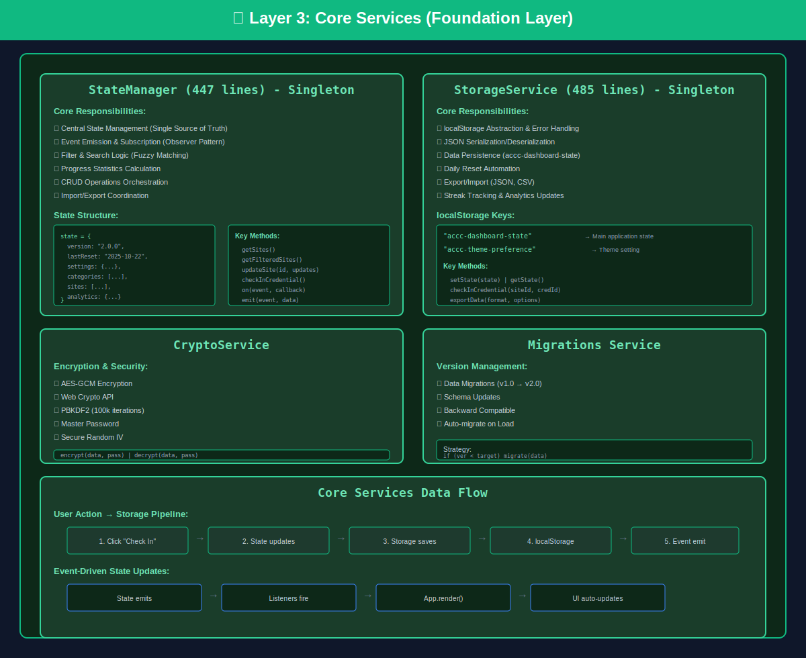
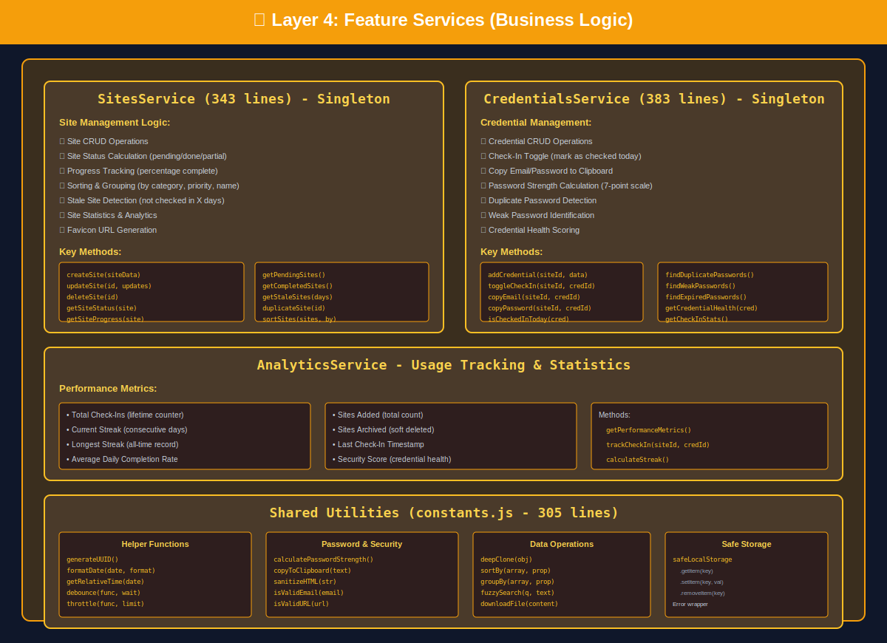
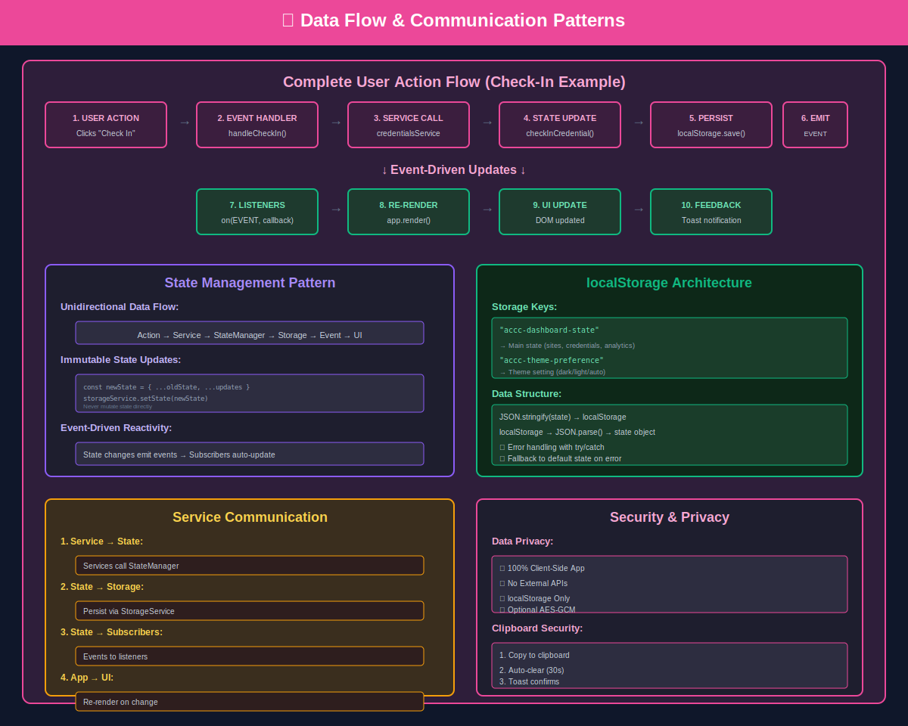

# 🔐 DashOrg - Architecture Diagrams

> Enhanced Credential Dashboard

Complete visual documentation of the project architecture, broken down into modular SVG diagrams for clarity and maintainability.

## 📊 Diagram Index

### [00-master-architecture-index.svg](./00-master-architecture-index.svg)
**Master Overview** - Start here!



- Project overview and statistics
- Links to all other diagrams
- Technology stack summary
- Design patterns used
- Key features overview

---

### [01-ui-presentation-layer.svg](./01-ui-presentation-layer.svg)
**Layer 1: UI / Presentation**



- index.html structure
- HTML components (modals)
- 8 modular CSS files architecture
- User interactions and events
- Visual feedback system
- Responsive design breakpoints

---

### [02-application-logic-layer.svg](./02-application-logic-layer.svg)
**Layer 2: Application Logic**



- main.js - App Class (1187 lines)
- config.js configuration structure
- ComponentLoader (dynamic HTML loading)
- Event system (Pub/Sub pattern)
- Application initialization flow

---

### [03-core-services-layer.svg](./03-core-services-layer.svg)
**Layer 3: Core Services**



- StateManager (447 lines) - Central state management
- StorageService (485 lines) - Data persistence
- CryptoService - Encryption (optional)
- Migrations - Version control
- Core services data flow

---

### [04-feature-services-layer.svg](./04-feature-services-layer.svg)
**Layer 4: Feature Services**



- SitesService (343 lines) - Site management
- CredentialsService (383 lines) - Credential operations
- AnalyticsService - Usage tracking
- Shared utilities (305 lines)

---

### [05-data-flow-diagram.svg](./05-data-flow-diagram.svg)
**Data Flow & Communication Patterns**



- Complete user action flow
- State management pattern
- localStorage architecture
- Service communication patterns
- Security and privacy flow

---

## 🎯 How to Use These Diagrams

1. **Start with the Master Index** (`00-master-architecture-index.svg`) to get an overview
2. **Explore each layer** sequentially (01 → 05) to understand the architecture from UI to data
3. **Use as reference** when working on specific features or understanding code flow
4. **Share with team** members for onboarding or architecture discussions

## 🏗️ Architecture Layers

```
┌─────────────────────────────────────────┐
│  Layer 1: UI / Presentation             │  ← User Interface
├─────────────────────────────────────────┤
│  Layer 2: Application Logic             │  ← Orchestration
├─────────────────────────────────────────┤
│  Layer 3: Core Services                 │  ← Foundation
├─────────────────────────────────────────┤
│  Layer 4: Feature Services              │  ← Business Logic
├─────────────────────────────────────────┤
│  Layer 5: Data Flow                     │  ← Communication
└─────────────────────────────────────────┘
```

## 📈 Key Metrics

- **Total LOC**: ~3,500+ lines
- **Main Application**: 1,187 lines (main.js)
- **Services**: 1,200+ lines
- **Core Layer**: 1,000+ lines
- **CSS Files**: 8 modular files
- **Documentation**: 5 MD files + 6 SVG diagrams

## 🛠️ Technology Stack

- **Frontend**: Vanilla JavaScript ES6+ (Zero Dependencies)
- **Styling**: Modular CSS3 (8 separate files)
- **Storage**: localStorage + Web Crypto API
- **Architecture**: Event-Driven, Service-Based, Layered

## 🎨 Design Patterns Used

- **Singleton Pattern**: All services
- **Observer Pattern**: Event system
- **Service Layer Pattern**: Business logic
- **Module Pattern**: Encapsulation
- **Facade Pattern**: App class
- **Immutable State**: Functional updates

## 📝 Notes

- All diagrams are standalone SVG files (no external dependencies)
- Optimized for viewing in modern browsers
- Can be opened directly or embedded in documentation
- Color-coded by layer for easy visual reference
- SVG images are displayed inline in this README for quick preview

## 🔍 Viewing Options

- **In GitHub**: SVG images render automatically in this README
- **Locally**: Open individual SVG files in any modern browser
- **In IDE**: Most modern IDEs (VS Code, etc.) can preview SVG files
- **In Documentation**: Embed using standard `` or markdown image syntax

---

**Created**: October 23, 2025  
**Project**: DashOrg - Enhanced Credential Dashboard v2.0.0
**Purpose**: Complete architecture documentation for developers and stakeholders